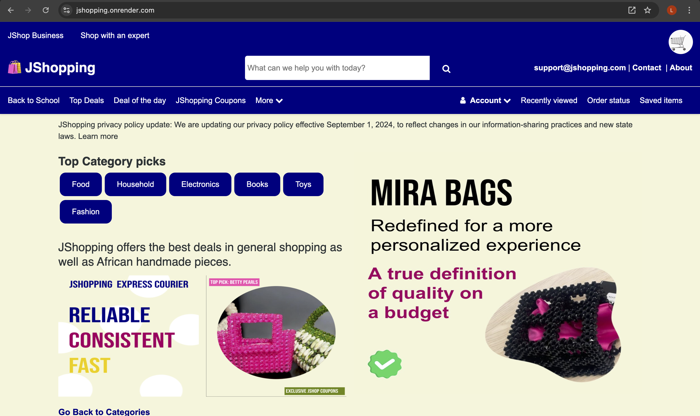
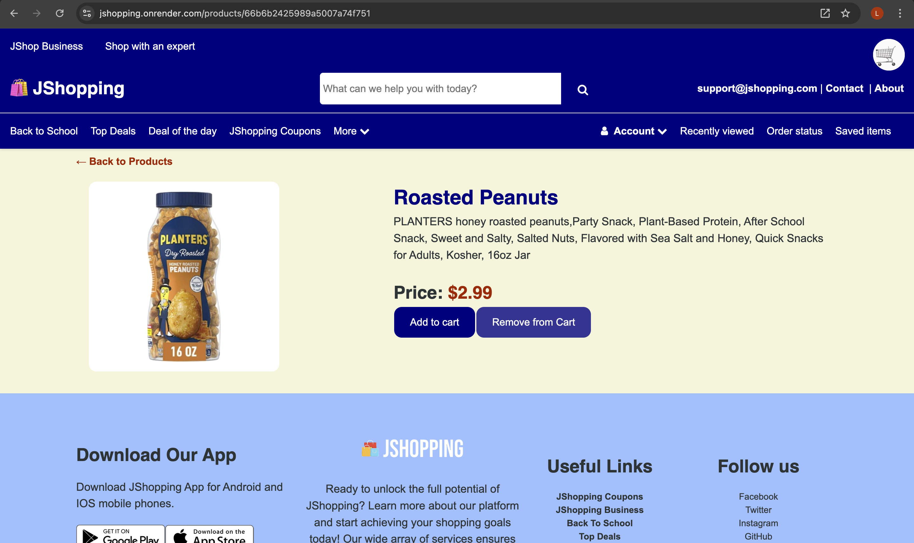
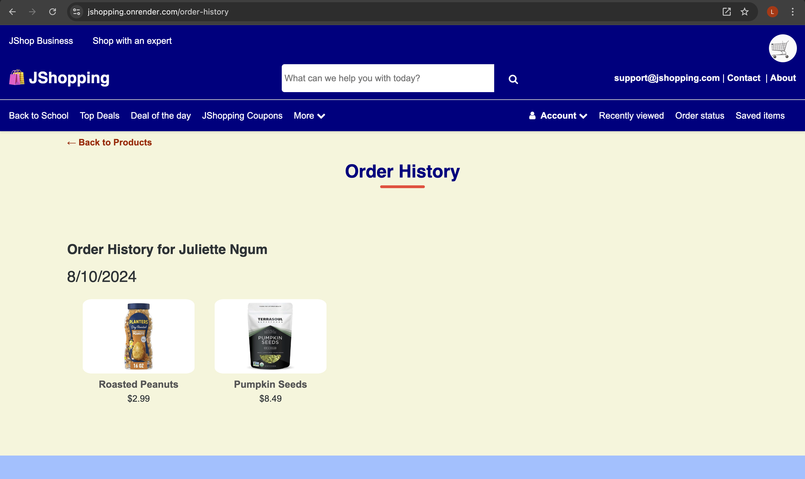
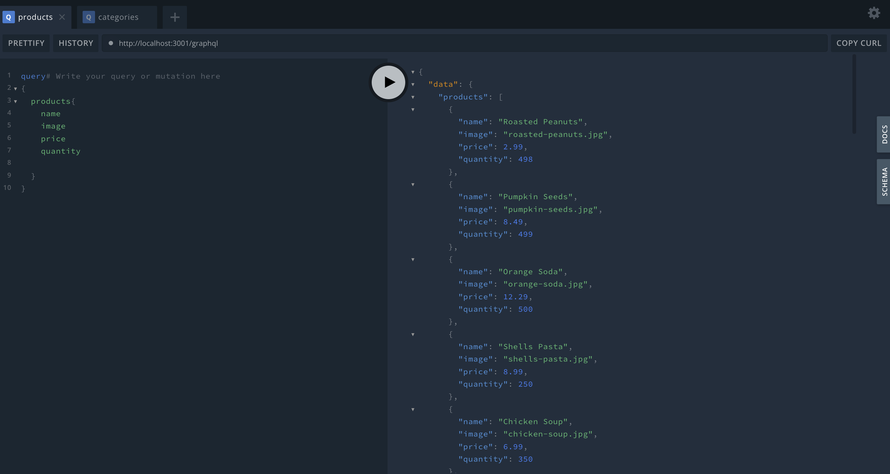
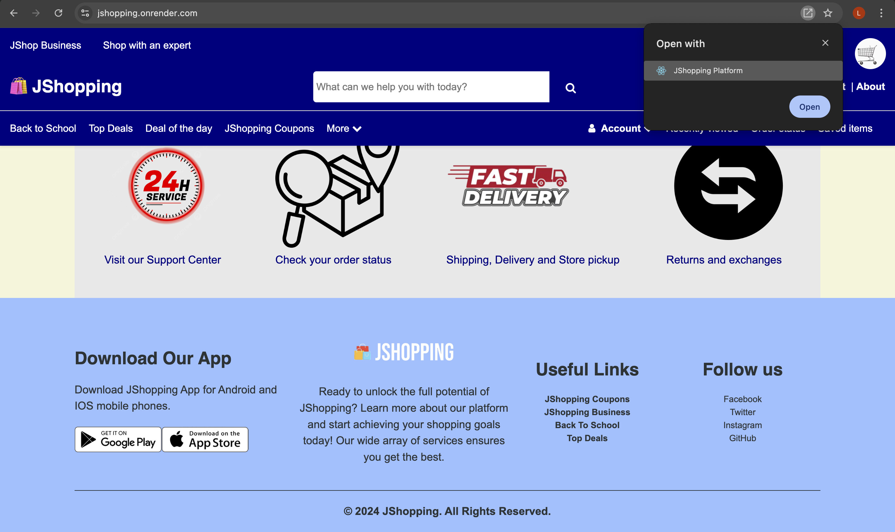

## JSHOPPING
   
### Project Summary
JShopping is an innovative e-commerce platform designed to offer a seamless shopping experience. Users can browse through a wide range of products across various categories on the homepage. With an intuitive search functionality, finding specific items or exploring different product categories is effortless.

### Technologies Used
* MERN (MongoDB, Mongoose, Expressjs, REACT, NodeJS)
* JavaScript
* GraphQL to fetch data from multiple data sources with a single API call.
* Apollo Server to attach GraphQL server to Express server.
* JsonWebToken to secure data
* CSS for styling whole application
* Stripe for payment with cards
* Service worker for PWA and installable application
* Render for deployment

### Deployment

[Deployment URL of JShopping Platform](https://jshopping.onrender.com/)

### Description

```
1. A user once on the app is presented with the homepage, which lists all the products and the product categories.
2. A user can search for products by category once on the homepage.
3. A user can view product details
4. ⁠A user can add an item to the cart or remove an item from the cart. This addition can take place directly from the homepage or while viewing the product details.
5. ⁠In the cart, the user can modify(update) the quantity of the items in the cart
6. For a user to checkout items in a cart, it should only be possible if the user is logged in.
7. ⁠The selected quantity of the product(s) in a cart should not exceed the total available quantity of the product.
8. ⁠Checkout should only be possible for one or more items.That is, there cannot be a checkout if the cart is empty.
9. ⁠During checkout, the user user should be redirected to stripe to make the payment.
10. ⁠Once payment is complete, the user should be redirected back to the shopping platform
11. ⁠The user should be able to see their order history and if empty, an appropriate message should be displayed
12. ⁠a user without an account can sign up.
13. ⁠Appropriate error messages should be displayed when a user tries to perform any action
14. ⁠Selecting a product category should display only products within that category as well as descriptive images and prices in USD.
```

### Deployment Steps [LOCAL]

- Download project
- Install npm packages with ```text npm i```
- Add a .env file to the root of project with details of database

```text
MONGODB_URI='mongodb_url'
NODE_ENV=development
STRIPE_KEY = 'YOUR_STRIPE_KEY'
```

- Seed default user tables
```text
npm run seed
```

- Run project
```text
npm run develop
```
- Visit port 3000 at http://localhost:3000
- Use GraphQL at http://localhost:3001/graphql

```text
USER 1
username: juliette@gmail.com
password: chocolate

USER 2
username: mikealson@gmail.com
password: chocolate
```

### Deployment Steps [ONLINE]


## https://render.com/

- Link to github repo
- Create webservice
- Input ENV credentials

```text
MONGODB_URI='mongodb_url_from_mongo_atlas'
NODE_ENV=production
STRIPE_KEY = 'YOUR_STRIPE_KEY'
```
- Deploy application

### STRIPE Payment Cards for testing

VISA
4242 4242 4242 4242
4000 0566 5566 5556

MASTER CARD.
5555 5555 5555 4444
2223 0031 2200 3222

Source:: stripe test docs (https://stripe.com/docs/testing#cards)


### Screenshots

Landing Page


Product Details


Cart with two products


Checkout


Order History


Fetching products with GraphQL


Installing the app to work as a Progressive Web App



## **_URL to GitHub Repository_**

https://github.com/juliettengum/jshopping


---------------------------------
